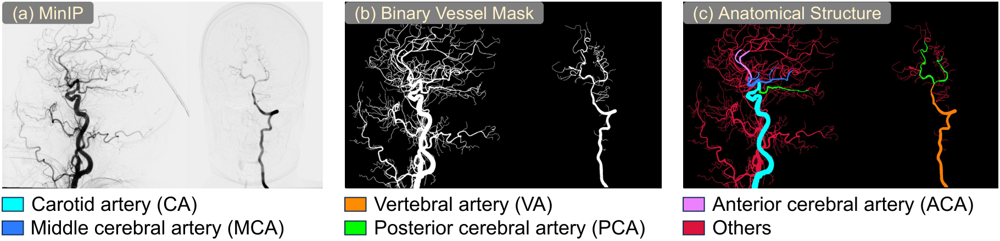
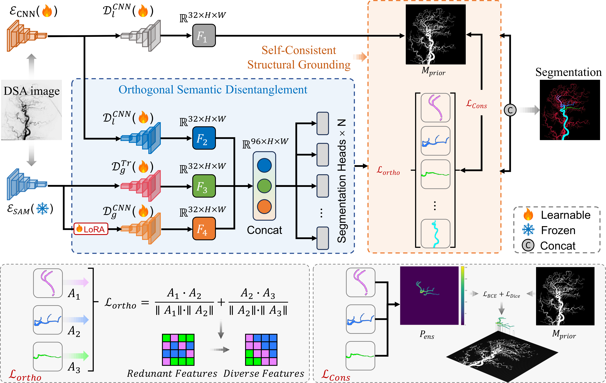

# AngioParse

**Structure-Aware Semantic Disentanglement for Cerebrovascular Parsing in DSA**

AngioParse is a deep learning framework for fine-grained anatomical parsing of the cerebrovascular tree in Digital Subtraction Angiography (DSA) images. It reformulates cerebrovascular parsing as a task of structure-aware semantic disentanglement, enabling precise categorization into six clinically distinct functional segments: Carotid Artery (CA), Vertebral Artery (VA), Anterior Cerebral Artery (ACA), Middle Cerebral Artery (MCA), Posterior Cerebral Artery (PCA), and Others.

<p align="center">
  
  <br>
  <em>Minimum intensity projection (MinIP) of a DSA sequence, binary vessel mask, and anatomical parsing result.</em>
</p>

## Overview



AngioParse employs a dual-pathway architecture with two core components:

- **Self-Consistent Structural Grounding (SCSG):** Enforces self-consistency between decoupled anatomical predictions and a global binary vascular prior, preserving topological integrity and mitigating vessel fragmentation.
- **Orthogonal Semantic Disentanglement (OSD):** Decomposes multi-target parsing into parallel binary heads with an orthogonality constraint, resolving projective ambiguity at vessel crossovers.

The framework synergizes a CNN expert (local fine-grained features) with SAM2 experts (global structural priors, including a frozen branch and an adapter-tuned branch).

## Results

| Method | Mean Dice | Mean IoU | Mean clDice |
|--------|-----------|----------|-------------|
| nnU-Net | 75.48 | 62.33 | 51.51 |
| BCU-Net | 72.88 | 59.09 | 48.02 |
| **AngioParse** | **78.51** | **67.79** | **53.70** |

## Installation

```bash
git clone https://github.com/kylechuuuuu/AngioParse.git                                                   
cd AngioParse                                                                                             
git clone https://github.com/facebookresearch/sam2.git                                                    
cd sam2                                                                                                   
mkdir sam2_pth                                                                                            
cd sam2_pth                                                                                               
wget https://dl.fbaipublicfiles.com/segment_anything_2/072824/sam2_hiera_large.pt                         
cd ../..                                                                                                  
pip install -r requirements.txt    
```

Place the SAM2 checkpoint at `sam2/sam2_pth/sam2.1_hiera_large.pt`.

## Dataset Structure

```
DSCA_new/
├── train/
│   ├── images/    # DSA MinIP images
│   └── masks/     # Pixel-level anatomical annotations
└── val/
    ├── images/
    └── masks/
```

## Usage

### Training

```bash
python train.py
```

### Testing

```bash
python test.py
```

### Evaluation

```bash
python calculate_metrics.py
```

## Requirements

- huggingface_hub, safetensors, einops, timm
- decord, pycocotools
- ftfy, regex
- sam2

## Citation

If you find this work useful, please cite the paper:

```bibtex
@inproceedings{angioparse2026,
  title={AngioParse: Structure-Aware Semantic Disentanglement for Cerebrovascular Parsing in DSA},
  author={...},
  booktitle={MICCAI 2026},
  year={2026}
}
```

## License

This project is licensed under the MIT License.
